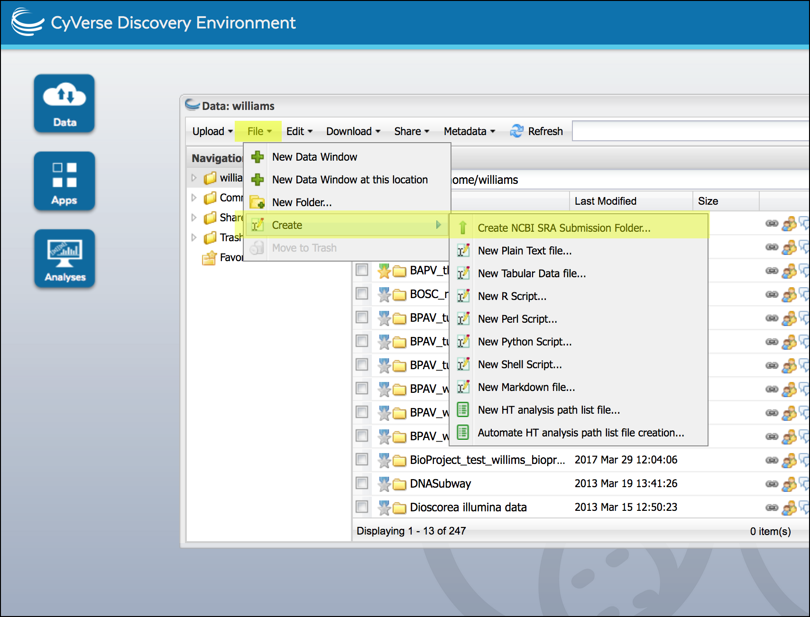
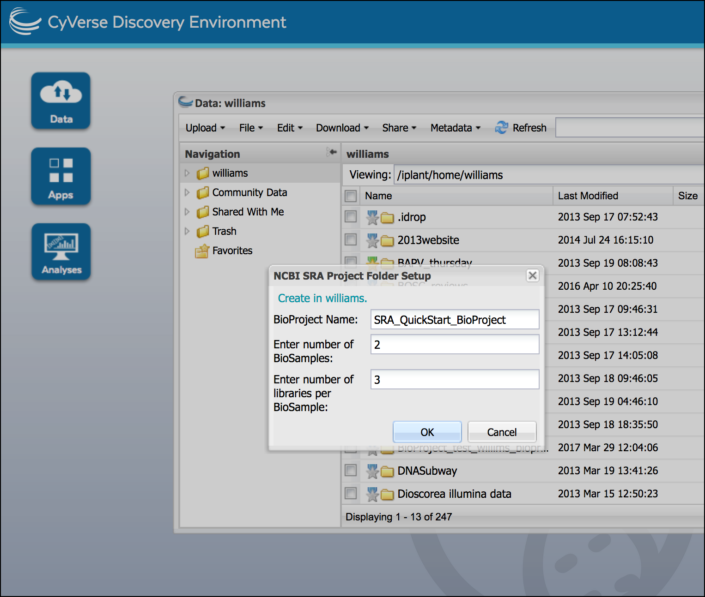
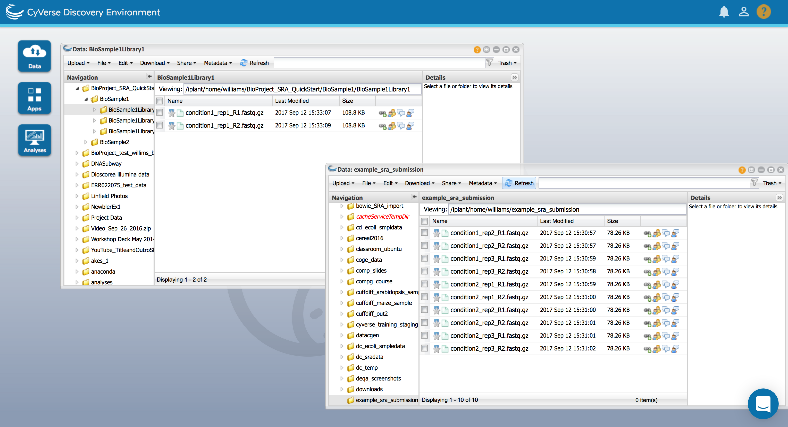

|CyVerse logo|_

|Home_Icon|_
`Learning Center Home <http://learning.cyverse.org/>`_

Create and organize an SRA submission package
===============================================

.. Important::
  **A Reminder on File Names and other SRA Requirements**

  NCBI has extensive requirements for depositing data into the SRA. The CyVerse
  submission pipeline is an attempt to streamline this process, but your
  submission must meet several requirements. File names must be unique,
  and may not contain special characters (e.g. { } ? * . , etc.) or spaces.

  The `SRA Submission Quick Start <https://www.ncbi.nlm.nih.gov/sra/docs/submit/>`_
  is the authoritative guide to SRA requirements. It is worth reading through this
  before submission.

.. important::
    This quickstart assumes you have uploaded your files to the CyVerse Data
    Store. If not, following the directions for `uploading files to the Data Store <https://cyverse-data-store-guide.readthedocs-hosted.com/en/latest/>`_.
    If possible, you may wish to compress these files using gunzip/bzip2 before
    upload.

(Optional) Compress files in the CyVerse Data Store using gunzip
-------------------------------------------------------------------
For submission through CyVerse, the sequence files must be compressed. If your
files are compressed (.gz/.bz2) you may skip this step.

  1. Login to the CyVerse `Discovery Environment <http://de.cyverse.org/>`_
  2. Click this link to open the `Compress files with gzip <https://de.cyverse.org/de/?type=apps&app-id=8beac104-3573-4cbe-8e2d-704470655cf9&system-id=de>`_
     App or click the **Apps** button and search for the "Compress files with gzip" App.
  3. Under "Inputs" select the individual file (FastQ/SFF/BAM) to compress
  4. Click 'Launch Analysis' to compress the file and click the **Analysis**
     button to monitor job status and view results. Once all files are compressed
     you may wish to gather them into a single folder to begin your submission.

    .. tip::
      Each file (e.g. read_R1.fastq) must be *individually* compressed (e.g.
      read_R1.fastq.gz)

Create SRA submission package and add sequence data
----------------------------------------------------
An SRA submission requires that your sequencing data are organized in a specific
structure of folders and subfolders. It will be helpful if you are familiar
with SRA terminology:

  .. tip::

   **SRA Terminology**

   Adapted from NCBI:

    - **BioProject**: A BioProject is a collection of biological data related to
      a single initiative, originating from a single organization or from a
      consortium.
    - **BioSample**: The BioSample database contains descriptions of biological
      source materials used in experimental assays. Different experimental
      conditions, tissue types, etc. would typically be different BioSamples.

   Your submission will contain the following folders and data:

   .. list-table::
     :header-rows: 1

     * - Folder
       - Description
       - Contents
       - Metadata
     * - BioProject (One per submission)
       - This is the top-level folder and will contain all
         other folder and data.
       - One or more BioSample folders
       - A BioSample Metadata template will specify details like the project
         summary, submitter/investigator information, etc.
     * - BioSample (One or more per submission)
       - BioSample folders, one for each experiment/
         tissue type, etc.
       - One or more library folders
       - A species/tissue specific metadata template will describe biological
         information about the sample (e.g. sex, collection location, etc.).
     * - Library (One or more per submission)
       - These folders will contain the sequencing data.
         Each replicate will have its own library folder.
       - Each library folder
         will contain one either one (single-end) or two (paired-end) sequence files.
       - A library metadata template will describe information about the
         sequencing run

  1. Login to the CyVerse `Discovery Environment`_.
  2. Click on **Data** to open a data window. In your home directory (or any
     directory your own) create the submission folder; Click on the "File" menu,
     then click 'Create' and select 'Create NCBI SRA Submission Folder'.

     |sra_1|

  3. Enter the name of your BioProject, and the number of BioSamples and libraries.
     click 'OK' to create the submission folders.

     .. tip::
       In our `Example data <http://datacommons.cyverse.org/browse/iplant/home/shared/cyverse_training/quickstarts/sra_submission/00_input_fastq_files>`_
       We have two experimental conditions with 3 sequencing replicates each so
       2 BioSamples and 3 libraries in each BioSample

     |sra_2|

  4. Place your sequence files in the appropriate library folders.

     .. tip::
       You can open multiple data window to facilitate drag-and-drop movement of
       files; from an open "Data" window click 'file' and select 'New Data
       Window.'

       |sra_3|

  5. Examine the example submission (`BioProject_SRA_QuickStart <http://datacommons.cyverse.org/browse/iplant/home/shared/cyverse_training/quickstarts/sra_submission/01_BioProjectExample>`_ folder)
     for refference and ensure your sequencing samples are appropriately organized.

----

**Fix or improve this documentation**

- On Github: `Repo link <https://github.com/CyVerse-learning-materials/sra_submission_quickstart>`_
- Send feedback: `Tutorials@CyVerse.org <Tutorials@CyVerse.org>`_

----

|Home_Icon|_
`Learning Center Home <http://learning.cyverse.org/>`_

.. |CyVerse logo| image:: ./img/cyverse_rgb.png
    :width: 500
    :height: 100
.. _CyVerse logo: http://learning.cyverse.org/
.. |Home_Icon| image:: ./img/homeicon.png
    :width: 25
    :height: 25
.. _Home_Icon: http://learning.cyverse.org/

