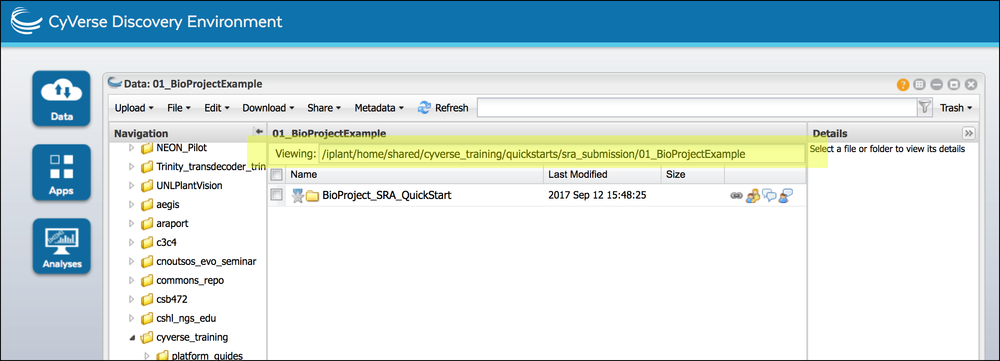
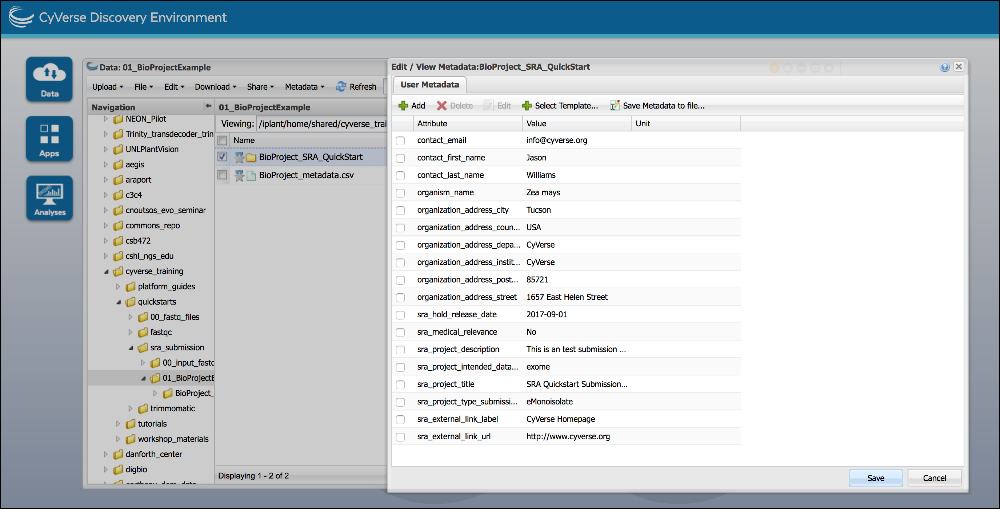

|CyVerse logo|_

|Home_Icon|_
`Learning Center Home <http://learning.cyverse.org/>`_

Record metadata and associate with SRA submission
=====================================================

In this section, you will complete **3 metadata templates** and associate these
metadata with your submission.

- **BioProject**: Metadata describing the overall project
- **BioSample**: Metadata describing the source materials sampled
- **Library**: Metadata describing the sequencing runs

.. warning::
  The metadata templates are defined by NCBI. Each field must be completed
  *exactly* as described. Any typos or invalid entries will cause your submission
  to be rejected.

I. Complete BioProject Metadata Template
-----------------------------------------
We will complete the BioProject Creation template to begin a new submission.
You can download a completed example template `here <http://datacommons.cyverse.org/browse/iplant/home/shared/cyverse_training/quickstarts/sra_submission/01_BioProjectExample/BioProject_metadata.csv>`__

  1. Login to the CyVerse `Discovery Environment <http://de.cyverse.org/>`_
  2. Click on **Data** to open a Data Window, and from the "Metadata" menu
     select 'Download Template.' Select the '**NCBI BioProject Creation**' and
     click 'OK' to download.

     .. Tip::
       The download will contain two compressed (.zip) CSV files:

       - **blank.csv**: This is the template to complete
       - **guide.csv**: These are the NCBI specified instructions for the template
         On your local computer

       You can edit the blank.csv template using any spreadsheet editor such as
       Excel

  3. Complete the metadata template according to the instructions in the guide;
     save the metadata file as a .csv file (for Excel we recommend saving as
     'CSV UTF-8 (Comma delimited)'). You may name this file whatever you wish
     we suggest a name other than blank to avoid confusion with other templates.

    .. warning::
      Excel and other spreadsheet editors may overwrite information (such as
      dates) with formatting. This makes Excel `notorious for use in bioinformatics <https://genomebiology.biomedcentral.com/articles/10.1186/s13059-016-1044-7>`_.
      Double check that dates and other entries in your template are not
      accidentally edited by Excel. When editing, you may use the Formatting
      feature (Format menu > Cells) to ensure your sheet is entirely formatted
      as text

    .. tip::
     **Tips for completing metadata templates**

     **Completing the file name or path field**
     The first column of CyVerse metadata templates is the 'file name or path'
     field. What should be entered is a path to the folder the metadata
     should be applied to. You can get this path from the Discovery Environment
     Data Window's "Viewing:" field:

     |sra_4|

     When copying your path **ensure the name of your top-level BioProject folder is included**

     **Following Guide Instructions**

     The guide gives additional information about the template including if a
     template feild is required, and if specific values (taken from
     controlled vocabulary) must be used. Something to remember include:

     - If an items 'required' value is **TRUE** you must provide a value, or enter one of the
       following null values: 'not collected', 'not applicable', or 'missing'.
     - When prompted for an **email address** enter the address associated with
       your NCBI account. Notifications will only be sent to this address.
     - The **value type** field indicates if the response is a single line of
       of alphanumeric characters (string), a multiline response, or an enumerated
       value (Enum). If a field must be an **Enumerated Value (Enum)** only use
       one of the terms specified in the guide
     - **Dates** must be entered in the order specified by NCBI (e.g. Year-Month-Day)

  4. Upload the completed template; from a Data window "Upload" menu chose
     'Simple Upload from Desktop'. You may upload to the same directory as
     your top-level BioProject folder, but do not place metadata files in your
     submission folders. (You may need to click "Refresh" to see the uploaded file)

  5. Associate the metadata with your BioProject; in a Data Window, select your
     BioProject top-level folder. From the "Metadata" menu select 'Apply Bulk
     Metadata' and then 'Select Metadata File'; select the uploaded metadata and
     browse to the uploaded file and click 'OK'. You should get a notification
     that the metadata application was successful.

  6. In a Data Window, select the BioProject folder and in the "Metadata" menu
     click 'Edit/View Metadata' to verify the metadata is applied and accurate.

     |sra_5|

II. Complete BioSample Metadata Template
-------------------------------------------

You will next need to select the appropriate BioSample template (organism/sample
specific) and apply this to all of your BioSample folders. Most of the information
may be the same for each BioSample, with differences including things like treatments
and/or tissue sources. You can view a completed example template `here <http://datacommons.cyverse.org/browse/iplant/home/shared/cyverse_training/quickstarts/sra_submission/01_BioProjectExample/BioSample_metadata.csv>`__

  1. If necessary, login to the CyVerse `Discovery Environment`_
  2. Click on **Data** to open a Data Window, and from the "Metadata" menu
     select 'Download Template.' Select and download the a "NCBI BioSample" appropriate for
     your submission. If you are unsure about which template to select; post a
     question to the `CyVerse User Forum <http://ask.iplantcollaborative.org/questions/>`_.
  3. Complete the metadata template (**See the warnings and tips in the BioProject Instructions above**).

      .. important::
        You must complete a row of metadata for **every** BioProject folder.
        The metadata for all your BioSamples can remain in the same file,
        assuming that template is appropriate for all the BioSamples in your
        project. If you require more than one BioSample template, you will need
        to complete a separate template for each relevant BioSample.

  4. Upload the completed template; from a Data window "Upload" menu chose
     'Simple Upload from Desktop'. You may upload to the same directory as
     your top-level BioProject folder, but do not place metadata files in your
     submission folders. (You may need to click "Refresh" to see the uploaded file)
  5. Associate the metadata with your BioSample; in a Data Window, select your
     **BioProject top-level folder**. From the "Metadata" menu select 'Apply Bulk
     Metadata' and then 'Select Metadata File'; select the uploaded metadata and
     browse to the uploaded file and click 'OK'. You should get a notification
     that the metadata application was successful.

     .. tip::

       Although you select your BioProject folder, since your metadata template
       specifically indicates the path your BioSample folders, metadata will
       be applied to those subdirectories.

  6. In a Data Window, select a BioSample folder and in the "Metadata" window
     click 'Edit/View' Metadata to verify the metadata is applied and accurate.
     Verify the metadata for each of your BioSamples.

III. Complete Library Metadata Template
-----------------------------------------

This final template will need to be completed for **every** BioSampleLibrary
folder. You can view a completed example template `here <http://datacommons.cyverse.org/browse/iplant/home/shared/cyverse_training/quickstarts/sra_submission/01_BioProjectExample/SRA_library_metadata.csv>`__

  1. If necessary, login to the CyVerse `Discovery Environment`_
  2. Click on **Data** to open a Data Window, and from the "Metadata" menu
     select 'Download Template.' Select and download the a "NCBI SRA Library"
     template.
  3. Complete the metadata template (**See the warnings and tips in the BioProject Instructions above**).

      .. important::
        You must complete a row of metadata for **every** BioSampleLibrary folder.
        The metadata for all your libraries can remain in the same file.
  4. Upload the completed template; from a Data window "Upload" menu chose
     'Simple Upload from Desktop'. You may upload to the same directory as
     your top-level BioProject folder, but do not place metadata files in your
     submission folders. (You may need to click "Refresh" to see the uploaded file)
  5. Associate the metadata with your BioSample; in a Data Window, select your
     **BioProject top-level folder**. From the "Metadata" menu select 'Apply Bulk
     Metadata' and then 'Select Metadata File'; select the uploaded metadata and
     browse to the uploaded file and click 'OK'. You should get a notification
     that the metadata application was successful.

     .. tip::

       Although you select your BioProject folder, since your metadata template
       specifically indicates the path your library folders, metadata will
       be applied to those subdirectories.

  6. In a Data Window, select a BioSampleLibrary folder and in the "Metadata" window
     click 'Edit/View' Metadata to verify the metadata is applied and accurate.
     Verify the metadata for each of your BioSampleLibrary folders.

.. warning::

  Once you have finished adding metadata to your submission folders, you cannot
  move or rename those folders without going back to edit the metadata entries.

IV. Generate summary metadata file
------------------------------------

We will now generate a file that captures the metadata for the entire submission.
In the next step, we will validate our results. You view an example of this
file `here <http://datacommons.cyverse.org/browse/iplant/home/shared/cyverse_training/quickstarts/sra_submission/01_BioProjectExample/submission_metadata.xml>`__

  1. If necessary, login to the CyVerse `Discovery Environment`_
  2. Click on **Data** to open a Data Window, and select your top-level BioProject
     folder. From the "Metadata" menu, select 'Save Metadata to file'; save
     the file with a descriptive name and a .xml ending (this make take a few
     minutes to generate; you may need to click "Refresh" to see the file).

----

**Fix or improve this documentation**

- On Github: `Repo link <https://github.com/CyVerse-learning-materials/sra_submission_quickstart>`_
- Send feedback: `Tutorials@CyVerse.org <Tutorials@CyVerse.org>`_

----

|Home_Icon|_
`Learning Center Home <http://learning.cyverse.org/>`_

.. |CyVerse logo| image:: ./img/cyverse_rgb.png
    :width: 500
    :height: 100
.. _CyVerse logo: http://learning.cyverse.org/
.. |Home_Icon| image:: ./img/homeicon.png
    :width: 25
    :height: 25
.. _Home_Icon: http://learning.cyverse.org/

