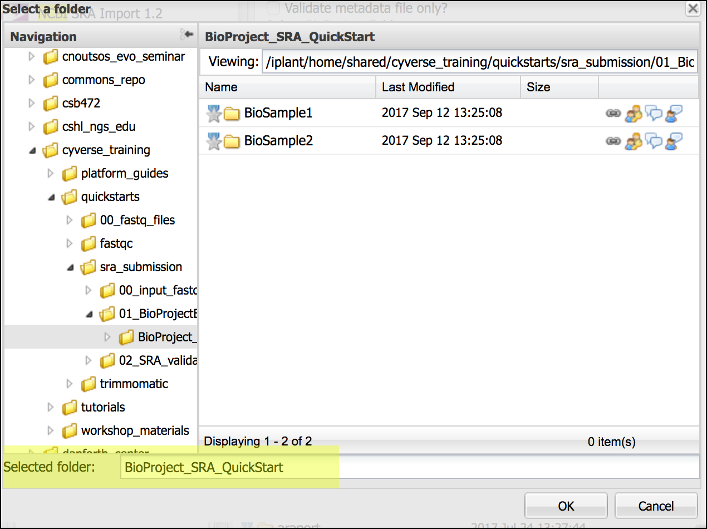

|CyVerse logo|_

|Home_Icon|_
`Learning Center Home <http://learning.cyverse.org/>`_

Validate and submit package to SRA
======================================

I. Validate Submission
------------------------

In this section, you will verify that metadata has been appropriately associated
with your submission package and complete the submission process.

  1. Login to the CyVerse `Discovery Environment <http://de.cyverse.org/>`_
  2. Click the link to open the `NCBI SRA Submission - BioProject Creation <https://de.cyverse.org/de/?type=apps&app-id=12b3d052-ff2c-11e4-93e3-7bd94c69063a&system-id=de>`_ App,
     or in the Discovery Environment, click **Apps** to open Apps menu and
     search for the "NCBI SRA Submission - BioProject Creation" App.
  3. If desired, enter an analysis name or comments.
  4. Under "Inputs" check **'Validate metadata file only?'**.
  5. Under 'Select BioProject Folder' browse to and select the top-level BioProject
     folder. Under 'Select BioProject metadata file' browse to and select the
     previously generated metadata file (.xml).

      .. tip::
        When browsing for the folder, ensure the "Selected folder" is your
        BioProject folder, not a sub-folder.

        |sra_6|
  6. Click 'Launch Analysis' to begin the validation, and click on **Analyses**
     to monitor the job progress. When status is 'Completed', click on the job
     name to view results. A successful validation will generate two folders

       - A folder of logs
       - A folder with your username and a long alphanumeric string.  This folder
         will contain the submission.xml metadata file associated with your submission.

      .. tip::
        Although a job returns with the status 'Complete' that does not mean that
        the submission is error-free. In the submission process, NCBI will review
        the submitted files and metadata and may discover errors.

        **For failed validation/submissions**
        For either validation or submission, if the app fails and no submission.xml
        file is created, there are one or more errors in the submission package.
        See the Analysis log files (especially condor-stderr-0) for information
        to assist with error correction.

II. Send submission package to SRA
------------------------------------
In this step, we use the application above, but the option to 'Validate metadata
file only' is left **unchecked**.

  1. If necessary, login to the CyVerse `Discovery Environment`_
  2. Click the link to open the `NCBI SRA Submission - BioProject Creation`_ App,
     or in the Discovery Environment, click **Apps** to open Apps menu and
     search for the "NCBI SRA Submission - BioProject Creation" App.
  3. If desired, enter an analysis name or comments.
  4. Under 'Select BioProject Folder' browse to and select the top-level BioProject
     folder. Under 'Select BioProject metadata file' browse to and select the
     previously generated metadata file (.xml).
  5. Click 'Launch Analysis' to begin the validation, and click on **Analyses**
     to monitor the job progress. When status is 'Completed', click on the job
     name to view results. A successful validation will generate two folders

       - A folder of logs. You should find a 'manifest.txt' file documenting the
         files transferred to the SRA
       - A folder with your username and a long alphanumeric string.  This folder
         will contain the .xml metadata file associated with your submission.

----

**Fix or improve this documentation**

- On Github: `Repo link <https://github.com/CyVerse-learning-materials/sra_submission_quickstart>`_
- Send feedback: `Tutorials@CyVerse.org <Tutorials@CyVerse.org>`_

----

|Home_Icon|_
`Learning Center Home <http://learning.cyverse.org/>`_

.. |CyVerse logo| image:: ./img/cyverse_rgb.png
    :width: 500
    :height: 100
.. _CyVerse logo: http://learning.cyverse.org/
.. |Home_Icon| image:: ./img/homeicon.png
    :width: 25
    :height: 25
.. _Home_Icon: http://learning.cyverse.org/

