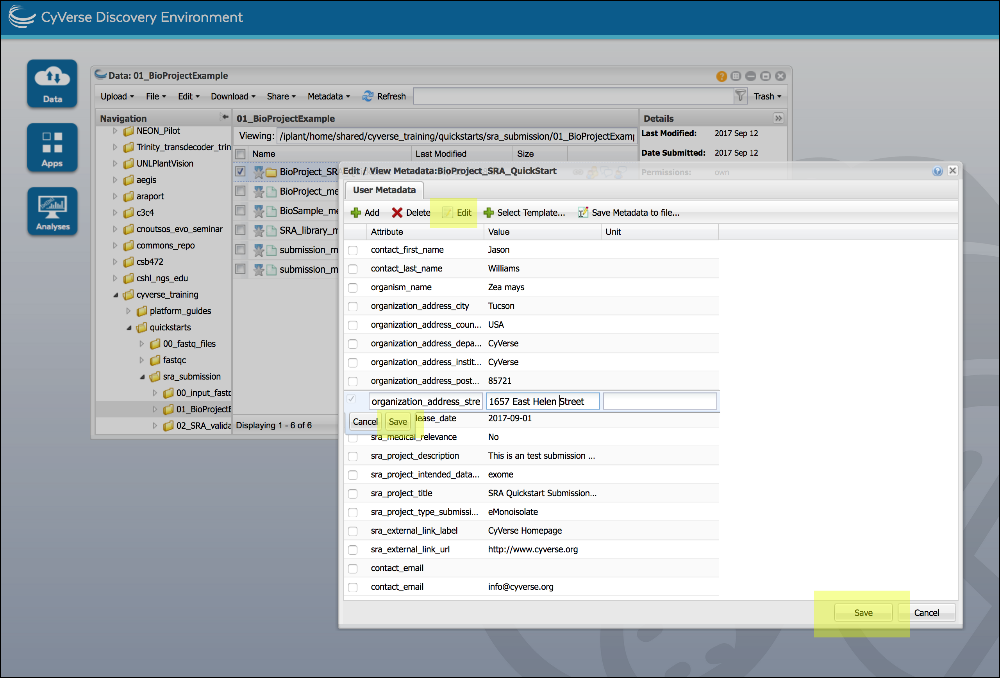

|CyVerse logo|_

|Home_Icon|_
`Learning Center Home <http://learning.cyverse.org/>`_

Confirm submission to SRA and fix errors
===========================================

CyVerse systems connect to SRA systems and create the submission folder on the
SRA side.  Files are transferred and a 'submit.ready' file is sent to the SRA to
signal that the submission package is complete and they can begin processing.
The SRA system validates the submission package and generates a report.xml file
containing any errors detected. The SRA system sends notification email(s) to
the contact email provided in the BioProject metadata template, and to the
CyVerse team to notify of either a successful or failed submission.

If your SRA submission is successful
--------------------------------------
You will receive an email ("Submission ownership transfer") at the email address
provided in the package metadata (also associated with your NCBI account).
After ownership transfer, you can view the submission progress at
`https://submit.ncbi.nlm.nih.gov/subs/ <https://submit.ncbi.nlm.nih.gov/subs/>`_.
You may need to log in with the NCBI credentials for the account you used in the
submission metadata.

If your SRA submission contains Errors
----------------------------------------
You will recive an email at the email address provided in the package metadata
(also associated with your NCBI account) informing you about the error. you can
retrieve the submission report.xml file from SRA servers with the 'NCBI SRA
Submission Report Retrieval' App in the DE, make corrections, and resubmit.

1. Login to the CyVerse `Discovery Environment <http://de.cyverse.org/>`_
2. Click the link to open the `NCBI SRA Submission - Report Retrieval <https://de.cyverse.org/de/?type=apps&app-id=30f67e7c-203b-11e5-b426-3ba3fa7cf733&system-id=de>`_ App or
   or in the Discovery Environment, click **Apps** to open Apps menu and
   search for the "NCBI SRA Submission - Report Retrieval" App.
3. If desired, enter an analysis name or comments.
4. For "Inputs" under 'Select NCBI SRA Submission App Output Folder' browse to
   and select the output folder previously generated in the submission (this
   should have your username followed by an alphanumeric string).
5. Click 'Launch Analysis' to begin the validation, and click on **Analyses**
   to monitor the job progress. When status is 'Completed', click on the job
   name to view results. The App will generate two folders:

     - A folder of logs.
     - A folder with your username and a long alphanumeric string.  This folder
       will contain a report detailing the errors detected. You should correct
       these errors (see tip below) and resave the metadata file (see IV. Generate
       summary metadata file).

    .. tip::

      **Fixing errors in metadata entries**

      To fix metadata entries, it is not *not* necessary to download/edit/upload
      templates. For a folder you wish to correct, select the folder in a Data
      window and from the "Metadata" menu select 'Edit/View metadata'; select
      any entry you wish to edit and then click the 'Edit' button. Save your edit
      and then click 'Save' again to save the metadata file.

      |sra_7|

      **Other tips**

      - Remember to save a new metadata file from the top level of the
        submission package before resubmitting. It is best practice to name
        this file differently from the previous metadata file.
      - During error correction, only make changes to SRA-detected errors. All
        other changes will be ignored by the SRA during resubmission. If
        additional changes are required, they can be made using the NCBI website
        after successful submission.
      - If no report.xml is retrieved, this does not necessarily mean your
        submission failed. The SRA system may not have generated it yet. Make
        sure to wait for notification from the SRA that the submission has been
        received and processed.

**Next Steps:**

Once you have verified your files are available to the SRA, you can consider
deleting these files from the CyVerse Data Store.

----------

Additional information, help
~~~~~~~~~~~~~~~~~~~~~~~~~~~~

..
    Short description and links to any reading materials

Search for an answer: `CyVerse Learning Center <http://learning.cyverse.org>`_ or `CyVerse Wiki <https://wiki.cyverse.org>`_

Post your question to the user forum:
`Ask CyVerse <http://ask.iplantcollaborative.org/questions>`_

----

**Fix or improve this documentation**

- On Github: `Repo link <https://github.com/CyVerse-learning-materials/sra_submission_quickstart>`_
- Send feedback: `Tutorials@CyVerse.org <Tutorials@CyVerse.org>`_

----

|Home_Icon|_
`Learning Center Home <http://learning.cyverse.org/>`_

.. |CyVerse logo| image:: ./img/cyverse_rgb.png
    :width: 500
    :height: 100
.. _CyVerse logo: http://learning.cyverse.org/
.. |Home_Icon| image:: ./img/homeicon.png
    :width: 25
    :height: 25
.. _Home_Icon: http://learning.cyverse.org/

